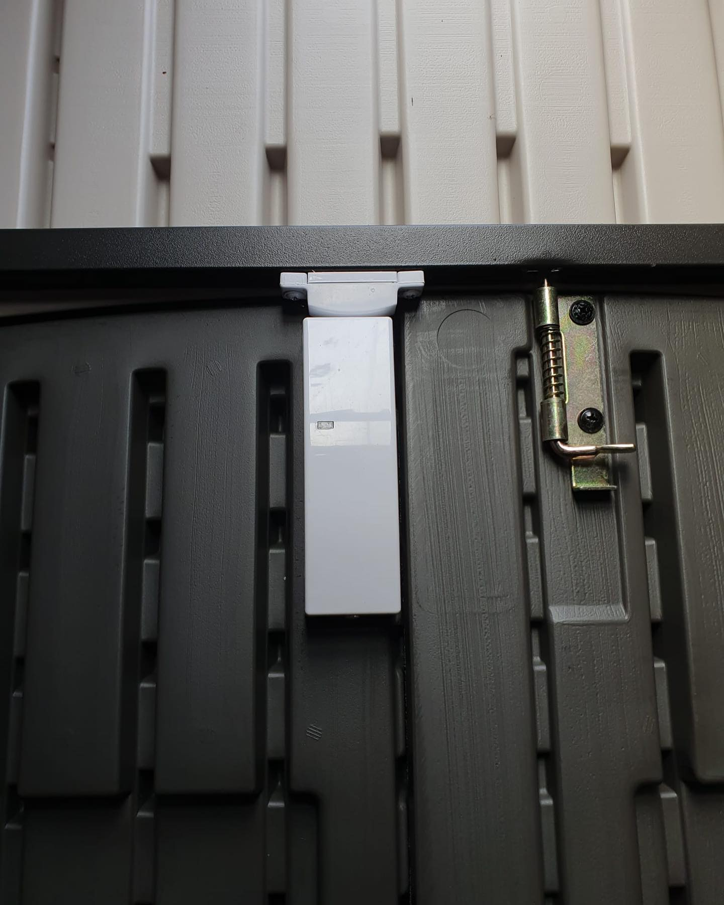

#### Alarm System For Shed Or Outhouse

Did you know that you can add your shed/outhouse/garage into your home alarm system? Here we have a garden shed that is made of plastic. We have installed a door contact on to the inside of the double shed doors and have linked this sensor up to the main house burglar alarm system. Door contacts/movement sensors can also be installed on to wooden sheds as well as plastic sheds or even summer houses etc. We have added a 'shed set' setting on to the system so that when you are home and want your home alarm off, you can set the shed set only, so if someone was to try and gain access to the shed, it would trigger your alarm system. 

[With all of our [burglar alarm systems](/categories/burglar-alarms/), we can create any setting you like so you can have your shed added to your home 'full alarm set' and to your 'bed set' also or it can have its own setting.]

The distance of the shed/outhouse/garage would have to be measured and the signal strength would have to be checked to make sure it can be linked. 

[]

